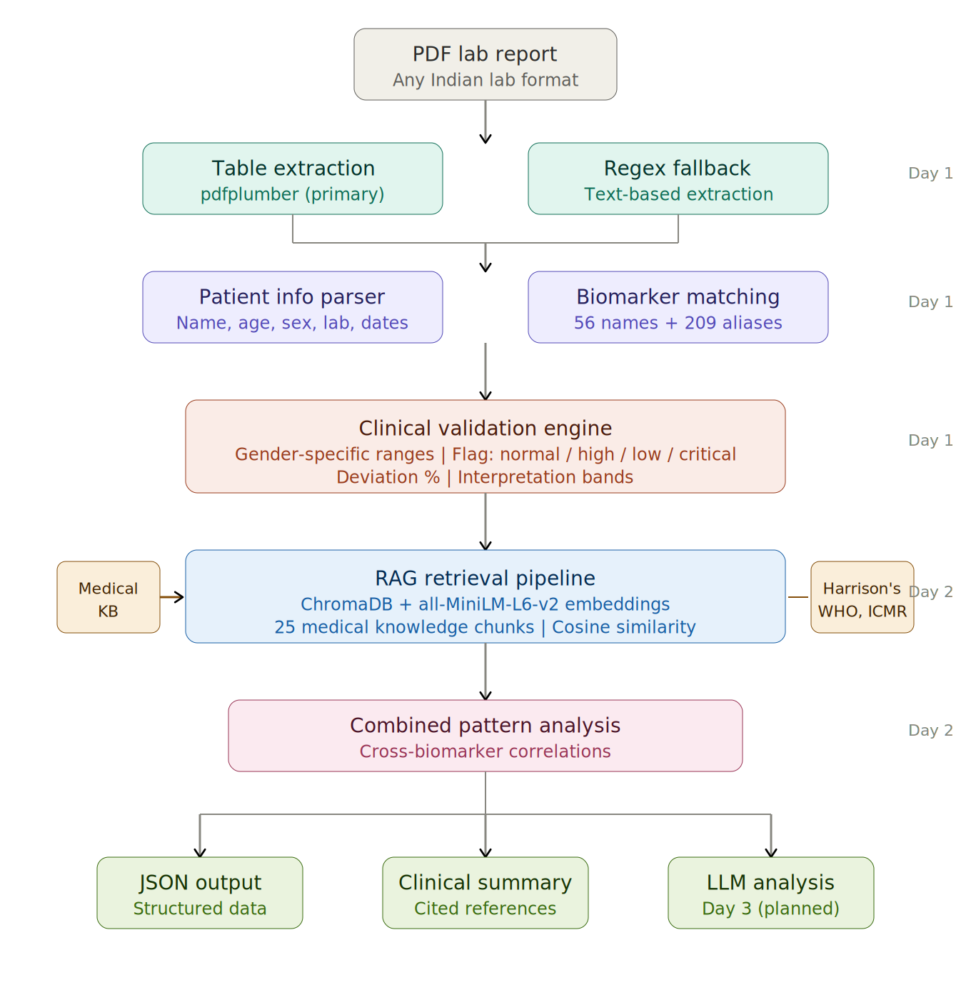

# MedScan AI — Intelligent Clinical Report Analyzer

**AI-powered system that parses clinical lab report PDFs, extracts biomarkers, validates against medical references, and generates cited differential analysis using RAG + multi-agent verification.**

*Built as a portfolio-grade case study demonstrating LLM orchestration, RAG architecture, PDF parsing, anatomical grounding, adversarial robustness, and domain-specific AI for healthcare.*

---


-00C853?style=flat-square)


---

## What Does It Do?

Upload a blood test / pathology / radiology report → the system:

1. **Extracts** structured biomarker data from any Indian lab format (Thyrocare, Dr. Lal PathLabs, SRL, Metropolis, Apollo, etc.)
2. **Validates** each value against 88 clinically standardized reference ranges (Harrison's, WHO, ICMR, Tietz)
3. **Flags** abnormal, critical, and borderline values with deviation percentages and interpretation bands
4. **Retrieves** relevant medical literature via RAG (41 knowledge chunks, ChromaDB + sentence-transformers)
5. **Analyzes** using clinical reasoning chains — generates causes, actions, urgency classification, and cross-biomarker pattern detection
6. **Verifies** using multi-agent architecture (Extractor + Critic) with anatomical grounding to prevent hallucinations
7. **Parses** radiology text reports (CT/MRI/X-ray) and cross-references findings with blood work
8. **Presents** everything in a modern Streamlit UI with interactive Plotly visualizations

---

## Architecture



---

## Disease & Condition Coverage

### Blood-Based Analysis (88 biomarkers, 19 categories)

| Category | Biomarkers | Conditions Detected |
|----------|-----------|-------------------|
| CBC & Blood Count | 16 | Anaemia (iron-deficiency, B12, thalassemia), Leukocytosis, Thrombocytopenia |
| Lipid Profile | 5 | Dyslipidemia, Cardiovascular risk, Metabolic syndrome |
| Liver Function | 11 | NAFLD/NASH, Hepatitis, Cholestasis, Gilbert syndrome, Cirrhosis |
| Thyroid | 6 | Hypothyroidism, Hashimoto's thyroiditis, Hyperthyroidism |
| Kidney Function | 11 | CKD staging (G1-G5), Hyperuricemia/Gout, Electrolyte imbalances |
| Blood Glucose | 2 | Prediabetes, Type 2 Diabetes |
| Vitamins & Iron | 7 | Vitamin D deficiency, B12 deficiency, Iron deficiency anaemia |
| Infectious Disease | 8 | Dengue, Typhoid, Malaria, Tuberculosis, COVID-19 severity |
| HIV/Immunology | 2 | HIV staging, CD4-guided ART decisions |
| Hepatitis | 2 | Hepatitis B (acute/chronic/carrier), Hepatitis C |
| Inflammatory | 3 | Sepsis (CRP + PCT + IL-6), Cytokine storm, Bacterial vs viral |
| Tumour Markers | 8 | Prostate (PSA), Ovarian (CA-125), Colorectal (CEA), Liver (AFP), Pancreatic (CA 19-9), Lymphoma (LDH), Myeloma (SPEP) |
| Coagulation | 4 | DIC, DVT/PE risk, Haemophilia, Warfarin monitoring |
| Genetic/Haematology | 5 | Sickle cell disease/trait, Thalassemia major/trait, G6PD deficiency |

### Cross-Biomarker Pattern Detection

The system identifies patterns across multiple biomarkers that single-test analysis misses:

- **Metabolic syndrome** (TG + HDL + FBS triad)
- **Hypothyroidism causing dyslipidemia** (flags: don't start statins before treating thyroid)
- **Iron + B12 combined deficiency** (masked MCV — common in Indian vegetarians)
- **Hashimoto's + Vitamin D deficiency** (autoimmune clustering)
- **NAFLD pattern** (ALT + GGT + metabolic risk factors)
- **Sepsis pattern** (CRP + PCT + WBC + lactate)
- **DIC pattern** (PT + aPTT + fibrinogen + D-dimer + platelets)
- **Tumour marker patterns** (PSA + ALP for bone mets, AFP + liver enzymes for HCC)

### Radiology Text Report Parsing

Parses radiologist's written findings from CT, MRI, X-ray, and ultrasound reports. Detects 20+ conditions across 10 body regions with automatic biomarker cross-referencing.

---

## Anti-Hallucination System

### Problem Solved

Standard LLM systems can produce anatomically impossible findings (e.g., "Hydronephrosis in Brain"). MedScan AI prevents this through:

### 1. Anatomical Grounding Engine
Every pathological condition is mapped to its required organ system. Every scan region defines allowed organ systems. If the required system doesn't overlap with the allowed systems, the finding is rejected as a **Document Inconsistency**.

### 2. Chain-of-Thought Verification
```
Step 1: Scan region is 'brain'.
Step 2: Allowed organ systems for 'brain': {'cns'}.
Step 3: 'hydronephrosis' requires systems: {'renal'}.
Step 4: FAIL — {'renal'} does not overlap with {'cns'}.
         THIS IS AN ANATOMICAL IMPOSSIBILITY.
```

### 3. Multi-Agent Architecture
- **Extractor Agent**: Pulls structured facts from reports
- **Critic Agent**: Validates facts for logical consistency. Never sees raw text — only structured facts.

### 4. Red-Team Adversarial Testing
Tested against 100 findings (50 correct + 50 deliberately hallucinated):
- **50/50 correct findings**: Passed (zero false positives)
- **49/50 hallucinated findings**: Caught (99% detection rate)
- **Overall accuracy: 99%**

---

## Validation Results

### Extraction Accuracy (5 reports, 5 lab formats)

| Report | Tests | Abnormal | Patient Parsed | Status |
|--------|-------|----------|---------------|--------|
| Full Panel (CBC+Lipid+LFT+Thyroid+KFT+Glucose+Vitamins) | 52 | 28 | ABHINAV PANDEY, 33M | PASS |
| Thyroid Panel (SRL format) | 7 | 4 | Priya Sharma, 28F | PASS |
| Infectious Disease (Dengue+Typhoid+Malaria+CRP) | 18 | 13 | RAVI KUMAR, 45M | PASS |
| Tumour Markers (PSA+CEA+AFP+CA19-9+LDH) | 12 | 10 | SURESH PATEL, 62M | PASS |
| Coagulation + Critical (DIC pattern) | 15 | 14 | MEERA JOSHI, 38F | PASS |

### Test Suite Summary

| Suite | Tests | Status |
|-------|-------|--------|
| Day 1: Extraction Engine | 4/4 | PASS |
| Day 2: RAG Pipeline | 3/3 | PASS |
| Day 3: LLM Analysis Engine | 5/5 | PASS |
| Day 4: Red-Team Adversarial | 3/3 | PASS |
| Day 5: Full Pipeline Validation | 5 reports | PASS |

---

## Project Structure

```
medscan-ai/
├── app.py                              # Streamlit UI (Plotly visualizations)
├── requirements.txt
├── README.md
├── LICENSE
│
├── src/
│   ├── pdf_extractor.py                # PDF extraction (table + regex fallback)
│   ├── clinical_references.py          # 88-biomarker reference DB (363 aliases)
│   ├── medical_knowledge.py            # 41 clinical knowledge chunks for RAG
│   ├── rag_pipeline.py                 # ChromaDB + sentence-transformers
│   ├── report_analyzer.py              # Extraction + RAG integration
│   ├── llm_engine.py                   # Clinical reasoning (local/Anthropic/OpenAI)
│   ├── anatomical_grounding.py         # Anatomy-Pathology validation matrix
│   ├── medical_verifier.py             # Multi-agent Extractor + Critic
│   └── radiology_parser.py             # CT/MRI/X-ray text parser
│
├── tests/
│   ├── generate_sample_reports.py      # 2 sample Indian lab PDFs
│   ├── generate_edge_case_reports.py   # 3 edge-case reports
│   ├── test_extraction.py              # 1 (4/4)
│   ├── test_day2_rag.py                # 2 (3/3)
│   ├── test_day3_llm.py                # 3 (5/5)
│   ├── test_red_team.py                # 4 Adversarial (3/3, 99%)
│   └── test_day5_validation.py         # 5 Comprehensive
│
├── data/
│   ├── sample_reports/                 # 5 test PDFs
│   └── processed/                      # Output JSONs
│
├── config/settings.json
└── docs/
    ├── architecture.png
    └── architecture.svg
```

---

## Quick Start

```bash
git clone https://github.com/Abhinav3419/Case-Studies.git
cd Case-Studies/06-MedScan-AI
pip install -r requirements.txt

# Generate sample reports
python tests/generate_sample_reports.py
python tests/generate_edge_case_reports.py

# Run tests
python tests/test_extraction.py
python tests/test_red_team.py

# Launch UI
streamlit run app.py
```

---

## Tech Stack

| Component | Technology |
|-----------|-----------|
| PDF Parsing | pdfplumber, pypdf |
| Reference DB | Custom Python (88 biomarkers, 363 aliases, 19 categories) |
| RAG | ChromaDB, sentence-transformers (all-MiniLM-L6-v2) |
| Reasoning | Template engine + Anthropic/OpenAI API support |
| Anti-Hallucination | Anatomical grounding + Multi-agent (Extractor + Critic) |
| Radiology | Pattern matching (20+ conditions, 10 body regions) |
| UI | Streamlit + Plotly |
| Testing | Red-team adversarial dataset (100 findings, 99% accuracy) |

---

## Reference Sources

Harrison's (21st Ed.) · Tietz (6th Ed.) · WHO (Anaemia, Dengue, Malaria, HIV, TB, COVID-19) · ICMR · AHA/ACC 2018 · ADA 2024 · ATA 2014 · KDIGO 2024 · NCCN · ISTH · Surviving Sepsis Campaign 2021 · NACO India · NTEP India 2024

---

## Disclaimer

**This tool is for educational and informational purposes only.** It is NOT a substitute for professional medical advice, diagnosis, or treatment. Always consult a qualified healthcare provider.

---

## Author

**Abhinav Pandey**
M.Tech (Applied Mechanics), MNNIT Allahabad | B.Tech (E&I), Ghaziabad

[Email](mailto:abhinavpandey3419@gmail.com) | [LinkedIn](https://www.linkedin.com/in/abhinavpandey-ai-ml/) | [GitHub](https://github.com/Abhinav3419) | [Portfolio](https://abhinav3419.github.io/)

---

## License

MIT — See [LICENSE](LICENSE)
